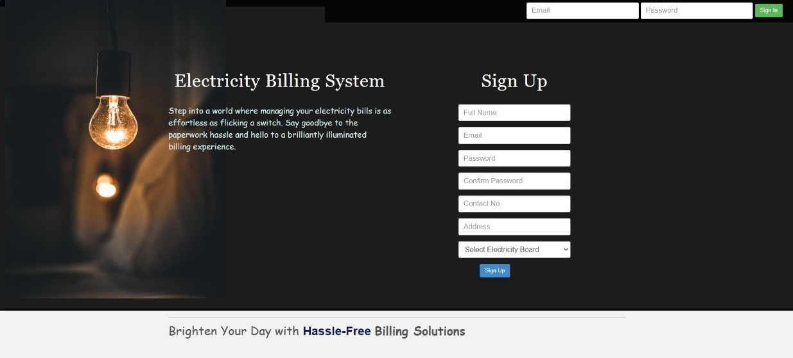
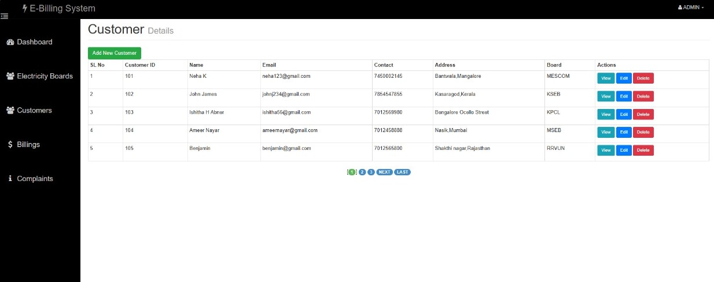
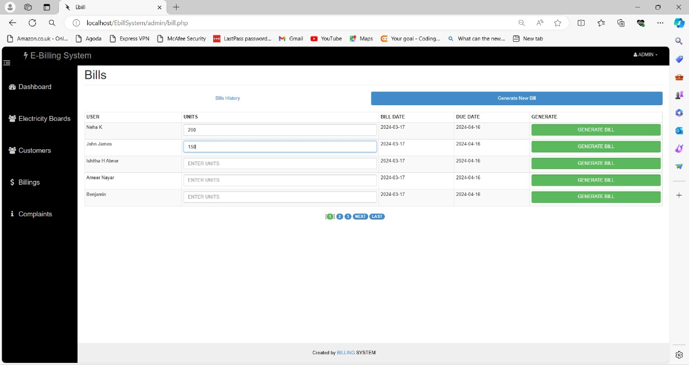
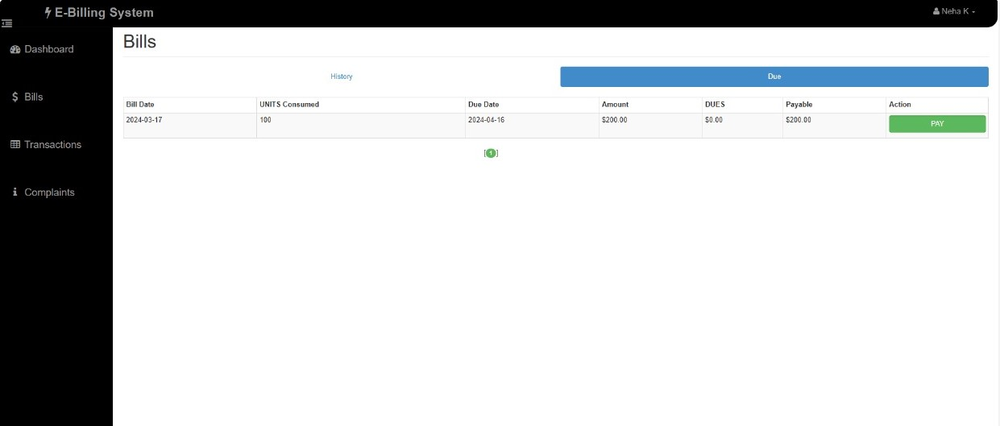

# ⚡ Electricity Billing System

Welcome to the **Electricity Billing System** – a PHP-based application designed to streamline the process of managing customer bills, payments, and complaints. This system offers comprehensive functionalities for both administrators and users, ensuring efficient billing and customer management.

## 🌟 Key Features

### Admin Panel
- **🧾 Manage Bills**: Check, issue, and update customer bills with ease.
- **👥 Customer Management**: Add new customers, view existing customers, and update or delete customer information.
- **📈 Transaction Monitoring**: Track payments and transaction histories.
- **🛠️ Handle Complaints**: View and resolve customer complaints efficiently.
- **⚙️ Manage Electricity Boards**: Add new electricity boards,view all boards,modify board information, remove boards and link customers to specific boards.
### User Portal
- **💡 View Bills**: Access personal billing information and history.
- **💳 Pay Bills**: Securely process payments for electricity consumption.
- **📣 Lodge Complaints**: Submit complaints regarding services or billing issues.

## 🛠️ Setup Guide

### Prerequisites
- PHP 7.x or higher
- MySQL
- A web server (XAMPP)

### Database:
- **Triggers**: Implemented to maintain data integrity and perform audits.

## 🛠️ Setup

### Prerequisites:
- PHP 7.x or higher
- MySQL
- A web server (e.g., Apache, Nginx, XAMPP, WAMP)
### ER Diagram

### 📸 Screenshots
### Admin Dashboard

### User Dashboard

